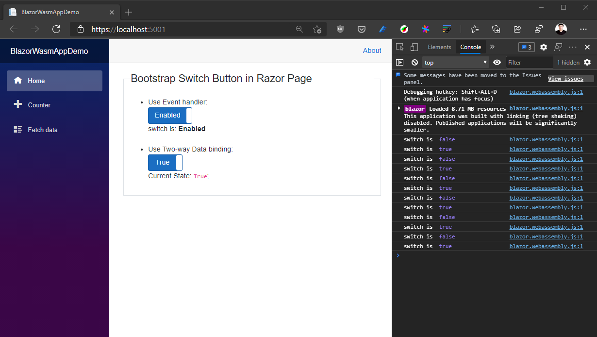

# Bootstrap Switch Button on Blazor WebAssembly Demo

The [`Client`](./Client) project demonstrates using [bootstrap-switch-button](https://gitbrent.github.io/bootstrap-switch-button/) on [Blazor WebAssembly hosting model](https://docs.microsoft.com/en-us/aspnet/core/blazor/hosting-models#blazor-webassembly).

